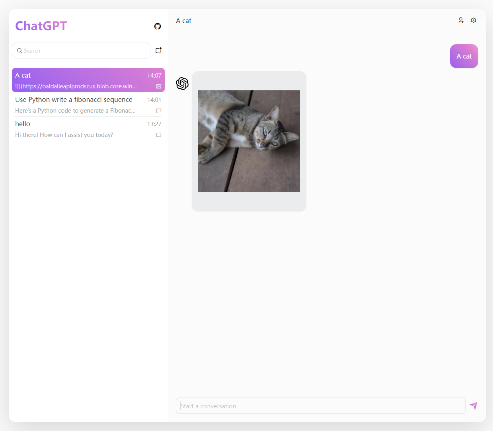

<h2 align="center">ChatGPT-Vercel</h2>

  

English | [简体中文](./README.zh-CN.md)

## Introduction
Building your own ChatGPT website by Vercel, support text conversation and prompt preset. Powered by OpenAI API GPT-4/3.5 and Vercel.

## Features
- [x] Text Conversation
- [x] Prompts Preset
- [ ] Images Generation
- [ ] Audio

## Getting Started

### 1. Create Project
Create Vercel project from a github forked project(recommand) or the following **Deploy** button.

### 2. Set OPENAI_API_KEY
There are three ways to set your openai api key:
- Set Vercel Environment Variables **OPENAI_API_KEY**
- Rename your `.env.expample` file to `.env` and set **OPENAI_API_KEY**
- Set **OPENAI_API_KEY** within the page

## Live Demo
- [chatgpt-vercel-sample](https://chatgpt-vercel-sample.vercel.app/)

## Configurations
### Deployment Configurations
All deployment configurations could be configured in the `.env` file or in **Environment Variables** of Vercel

| Configuration  | Default Value | Description                                                                          | 
| -------------- | ------------- | ------------------------------------------------------------------------------------ |
| OPENAI_API_KEY | -             | Key for API request, [how to generate](https://platform.openai.com/account/api-keys) |
| LANGUAGE       | en            | Website language, including prompts. Supported languages: **zh**/**en**              |

### Global Configurations
All global configurations will be stored locally

| Configuration             | Default Value | Description                                                                                                         |
| ------------------------- | ------------- | ------------------------------------------------------------------------------------------------------------------- |
| OpenAI Api Key            | -             | The same with the deployment configuration                                                                          |
| Model                     | gpt-3.5-turbo | Model used in api request, [supported models](https://platform.openai.com/docs/models/model-endpoint-compatibility) |
| Save current conversation | false         | The conversation won't be lost after the page is refreshed                                                          |

## Credits
- English prompts are modified from [awesome-chatgpt-prompts](https://github.com/f/awesome-chatgpt-prompts)
- Chinese prompts are modified from [awesome-chatgpt-prompts-zh](https://github.com/PlexPt/awesome-chatgpt-prompts-zh)

## License
Based on [MIT License]('./LICENSE')
