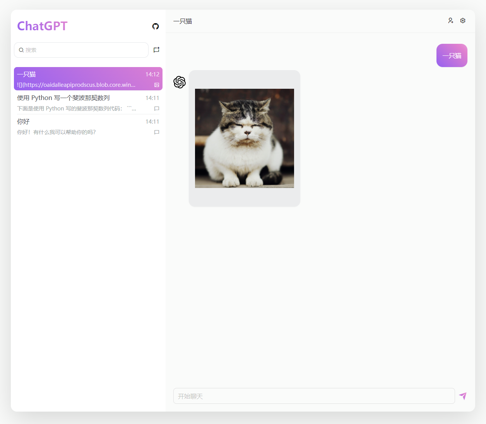

<h2 align="center">ChatGPT-Vercel</h2>

  
  
  

[English](./README.md) | 简体中文

## 简介
通过 Vercel 一键免费创建私有的 ChatGPT 站点， 支持多组 **文本**、**图像生成** 对话。由 OpenAI API 和 Vercel 提供支持。

## 主要功能
- ⚡ 通过 Vercel 一键免费部署，添加自己的域名即可无障碍访问
- 💬 文本对话，可以自由切换模型，设置上下文长度
- 🎨 图像生成对话，支持 `DALL-E` 和 `Midjourney` 模型，可以调整图片大小和数量
- 🌈 添加多种预设提示，定制 AI 行为
- 🌏 切换多种语言，目前支持 简体中文、英语
- 💭 聊天记录本地保存，支持搜索、导入和导出等

## 在线示例
- [chatgpt-vercel-zh-sample](https://chatgpt-vercel-zh-sample.vercel.app/)
- [chatgpt-vercel-sample](https://chatgpt-vercel-sample.vercel.app/)

## 使用指南
可以访问上面的在线示例或者自己私有化部署进行体验

### 对话
点击左上角可以添加对话，有两种类型：
- 文本对话：
  - 模型可选，[支持的所有模型](https://platform.openai.com/docs/models/model-endpoint-compatibility)
  - 默认为连续对话，每次发送会携带部分上下文
  - 支持添加预设提示，输入`/`或者点击左下角按钮添加
  - 支持模型配置，点击右上角设置图标进行配置
- 图像生成对话：
  - 模型可选，支持 OpenAI `DALL·E` 模型和 `Midjourney` 模型
  - 不支持连续对话，每次发送不会携带上下文
  - 直接输入你想要的图片效果，例如：`一只猫`
  - 对于 `DALL-E` 模型，消耗 `OpenAI` token，图片链接的有效访问时间为 `2` 小时，如有需要请及时保存
  - 对于 `Midjourney` 模型，依赖 `Discord` 相关配置，图片生成时间一般较长，默认超时时间为 `5` 分钟，请耐心等待

### 历史记录
全局设置中开启`保留所有会话`时会保存到本地缓存，默认不保存

### 操作
- `Enter` 键发送
- `Shift`+`Enter` 键换行
- 输入 `/` 添加预设，支持搜索

### 所有的设置
见 [配置](#配置)

## 私有化部署

### 1. 创建项目
从 github fork 的仓库（推荐）或者直接从下面的 **Deploy** 按钮创建一个 Vercel 项目。

### 2. 设置 OPENAI_API_KEY
有三种方式设置你的 OpenAI API Key:
- 在 Vercel 上设置环境变量 **OPENAI_API_KEY**
- 把 `.env.expample` 文件重命名为 `.env` 然后设置 **OPENAI_API_KEY**
- 直接在页面中填写 **OPENAI_API_KEY** 

如果没有 OpenAI API Key 可查看 [也许是时候拥有自己的「ChatGPT」了](https://juejin.cn/post/7210274432332939322)

> 注意：Vercel 所有环境变量设置后需要重新部署才能生效

### 3. 配置 Midjourney（可选）
如果你期望使用 `Midjourney` 的 AI 绘图功能，可以设置 `Discord` 的相关配置进行使用，包括以下字段：
- `DISCORD_SERVER_ID`
- `DISCORD_CHANNEL_ID`
- `DISCORD_TOKEN`

如何获得相关 id 和 token 可以参考：
- [How to find ids](https://docs.statbot.net/docs/faq/general/how-find-id/)
- [Get discord token](https://www.androidauthority.com/get-discord-token-3149920/)

可以前往 [midjourney-cookbook](https://gptgenius.github.io/midjourney-cookbook/) 获取一些 `Midjourney` prompt 样例

### 4. 设置默认语言（可选）
站点的默认语言是英文的，页面中支持切换语言，如果你希望部署一个默认中文站点，可以设置 **LANGUAGE** 为 `zh`，支持在 Vercel 环境变量和 `.env` 文件中配置

### 5. 绑定域名（可选）
拥有自己的域名，可以在 vercel 上的 domain 中进行设置，即可无障碍访问

> vercel.app 域名受限，但 vercel 本身并未受限

### 6. 保持代码同步更新（可选）
见 [Sync Fork](docs/sync.md)

## 其他部署方式
运行 `pnpm build` 和 `pnpm run server`，参考：[astro-node](https://docs.astro.build/en/guides/integrations-guide/node/#standalone)

## 配置
### 部署配置
所有部署配置都可以在 `.env` 文件或者 Vercel 的环境变量中配置

| 配置项               | 默认值         | 描述                                                                                                | 
| ------------------- | -------------- | -------------------------------------------------------------------------------------------------- |
| PASSWORD            | -              | 网站的访问密码                                                                                       |
| OPENAI_API_KEY      | -              | Api 请求使用的 key, 支持多个 key，以逗号分隔，[如何生成](https://platform.openai.com/account/api-keys) |
| LANGUAGE            | en             | 站点的默认语言，包含预设提示，支持的语言： **zh**/**en**                                               |
| API_KEY_STRATEGY    | random         | 多个 key 时的调度策略模式：轮询（**polling**）、随机（**random**）                                     |
| OPENAI_API_BASE_URL | api.openai.com | 请求 api 的默认地址                                                                                  |
| DISCORD_SERVER_ID   | -              | Discord 服务器 id                                                                                   |
| DISCORD_CHANNEL_ID  | -              | Discord 频道 id                                                                                     |
| DISCORD_TOKEN       | -              | Discord token                                                                                       |
| DISCORD_IMAGE_PROXY | -              | Discord 返回图片代理地址                                                                             |                   

### 全局配置
所有页面中的全局配置都会被缓存到本地

| 配置项              | 默认值        | 描述                                                                                                      |
| ------------------ | ------------- | --------------------------------------------------------------------------------------------------------- |
| OpenAI Api Key     | -             | 仅支持单个 key，页面里填写后不会使用环境变量中配置的 key                                                      |
| 语言               | en            | 站点的语言，包含预设提示，支持的语言： **zh**/**en**                                                          |
| 保留所有会话        | true          | 页面刷新会话不会丢失                                                                                        |
| 发散程度            | 1             | 数值越大，回答越随机，范围是 0-2                                                                            |
| 文本对话模型        | gpt-3.5-turbo | Api 请求中使用的模型，[支持的所有模型](https://platform.openai.com/docs/models/model-endpoint-compatibility) |
| 连续对话            | true          | 是否携带上下文进行对话                                                                                     |
| 携带历史消息数      | 4             | 连续对话时，携带的历史消息数                                                                                 |
| 图片生成对话模型    | DALL-E        | 支持的模型：**DALL-E** / **Midjourney** / **Replicate**                                                    |
| 生成图片数          | 1             | 图像生成对话时，单次对话生成的图片数                                                                         |
| 生成图片尺寸        | 256x256       | 图像生成对话时，单个图片的尺寸大小                                                                           |
| Discord Server Id  | -              | 页面里填写后不会使用环境变量中配置的值                                                                      |
| Discord Channel Id | -              | 同上                                                                                                     |
| Discord Token      | -              | 同上                                                                                                     |  

## 计划中的功能
- [ ] 支持导出功能，导出 markdown & 图片
- [ ] 支持主题色切换，目前默认为渐变紫色
- [ ] 支持音频对话
- [x] 支持通过其他模型生成图片

以上是计划开发的一些功能，欢迎共建，有其他想法也可以提相关 issue

## 本地开发
需要：
- **NodeJS** `v18` 或更高版本
- **pnpm** `v7` 或更高版本

代理：
- 本地默认通过自定义代理请求 openapi，需要在 `.env` 中设置 `LOCAL_PROXY`，暂不包含默认代理，设置代理请自行承担风险
- 不需要代理可以通过设置 `DISABLE_LOCAL_PROXY=true` 来关闭本地代理，此时会直接请求 `api.openai.com`

本地启动：
- 运行：`pnpm dev`
- 需要暴露端口，例如在 cloud ide 中使用，运行：`pnpm start`

构建：
- 运行：`pnpm build`

## 贡献
非常欢迎任何贡献。以下是一些提示：
- 改善翻译或者新增语言，修改 `lang` 目录，新增语言还需要修改 `src/utils/i18n.ts`
- 改善或者新增预设提示，修改 `prompts` 目录
- 优化 API，修改 `src/pages/api` 目录
- 优化页面交互，修改 `src/modules` 目录
- 新增功能支持，可以直接提 issue

## 致谢
- 英文预设提示修改自：[awesome-chatgpt-prompts](https://github.com/f/awesome-chatgpt-prompts)
- 中文预设提示修改自： [awesome-chatgpt-prompts-zh](https://github.com/PlexPt/awesome-chatgpt-prompts-zh)

## Star 历史

## 协议
基于 [MIT 协议](./LICENSE)
