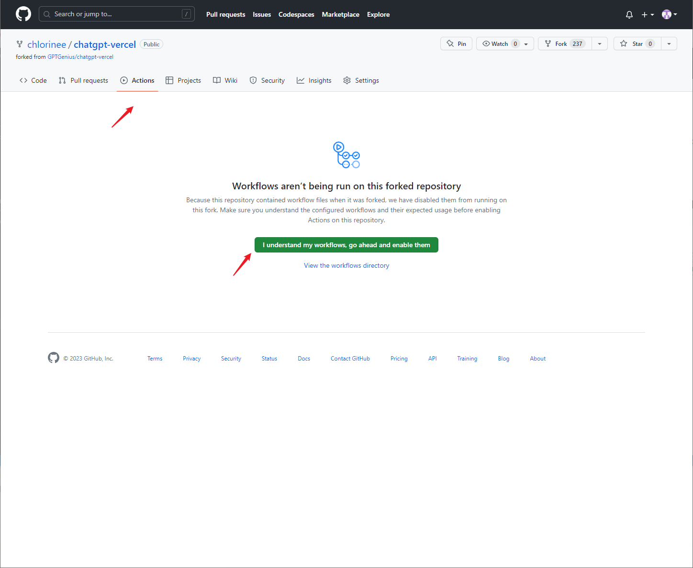
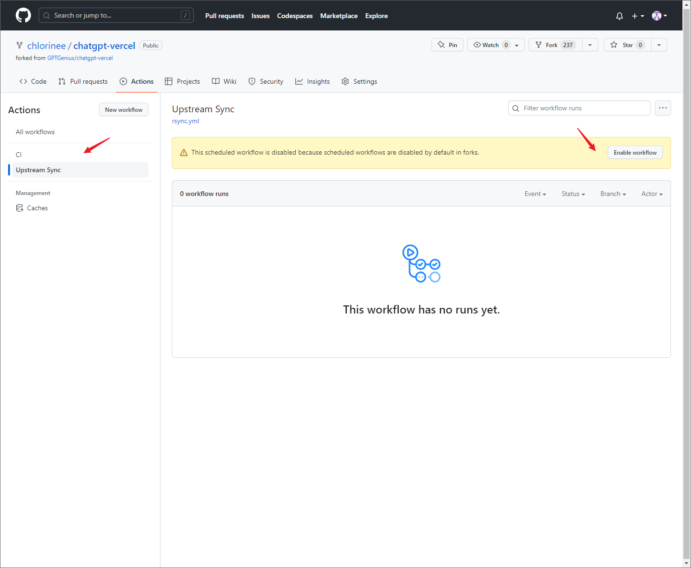

## Sync Fork
If you wish to keep your forked code updated, you may follow these steps:

如果你希望保持 fork 代码的同步更新，可以按以下步骤来操作：
### 1. First
Click Actions tab and enable workflows

点击 Actions 标签页然后启用 workflows

### 2. Second
Click `Upsteam Sync` and enable this workflow

点击 `Upsteam Sync` 并且启用该 workflow

